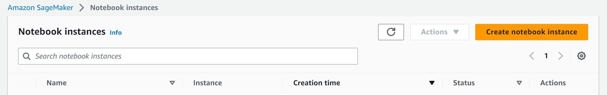
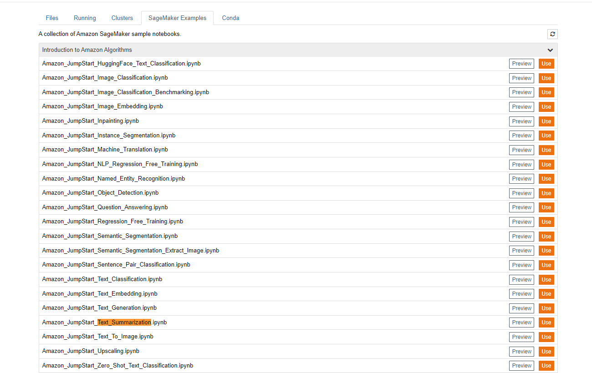
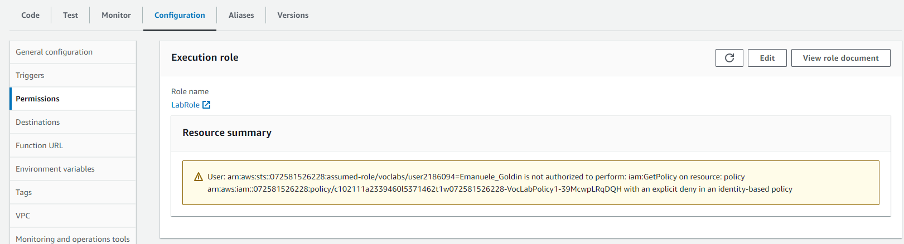
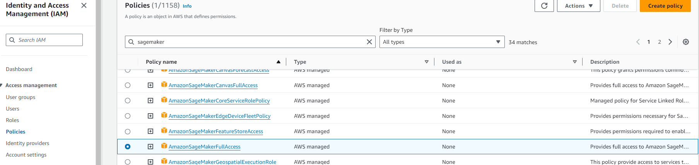

# Manual setup of Sagemaker and Lambda invocation

The following document will give an overview on how we were able to create our first dummy example of a summarization service invoked through a lambda function.

## Setup

### Step 1: create SageMaker notebook

There are different way to create the required resources. Since some jupyter notebboks are already provided by AWS tutorials, we decided to use a notebook to create them.

On the sidebar of SageMaker, select Notebook --> Notebook instances and create a new one


Once the instance is created (it might require up to 10 minutes), start the jupyter notebook.

From the notebook, browse existing project and select the text summarization one.


[This](https://github.com/aws/amazon-sagemaker-examples/blob/main/introduction_to_amazon_algorithms/jumpstart_text_summarization/Amazon_JumpStart_Text_Summarization.ipynb) is the project we used for our project.

### Step 2: deploy model and endpoint

Open the imported notebook and execute all the cells until the deployment operation (i.e., avoid running the last cell, where the previously deployed resources are destroyed).
This operation will require ~20 minutes

Note: as stated in the notebook itself, everything was tested using the *condra, python 3* kernel

### Step 3: Create lambda function

```python
# lambda body
import os
import io
import boto3
import json

# grab environment variables
ENDPOINT_NAME = "<the model endpoint created in the previous step>"
runtime= boto3.client('runtime.sagemaker')

def lambda_handler(event, context):
    data = json.loads(json.dumps(event))
    payload = data['input']
    
    encoded_text = payload.encode("utf-8")
    response = runtime.invoke_endpoint(EndpointName=ENDPOINT_NAME,
                                       ContentType='application/x-text',
                                       Body=encoded_text)
    # Parse response body
    responseBody = response['Body'].read()
    result = json.loads(responseBody)
    # Extract summary from the response body
    summary = result['summary_text']
    return summary
```

Expected input (JSON)

```json
{
  "input": "Some text to summarize"
}
```

### Step 4: Verify LabRole policies

From the lambda dashboard, open the **Configuration** tab and navigate to the *Permission* section



Here, click on the *Role name* to open the LabRole IAM page
On the sidebar, navigate to *Policies* and verify that *SageMakerFullAccess* is present.




## Limitations

A list of limitation of the various component follows.

### AWS student account

- Most services can be deployed exclusively to two regions (*us-east-1* and *us-west-2*)
- Policies offered by the *LabRole* IAM role

### Lambda

- Max. 10 concurrent instances

### SageMaker

- Request body max length: 6291456 \[investigate batch processing\]

### Model (huggingface)

- Can work only with english texts