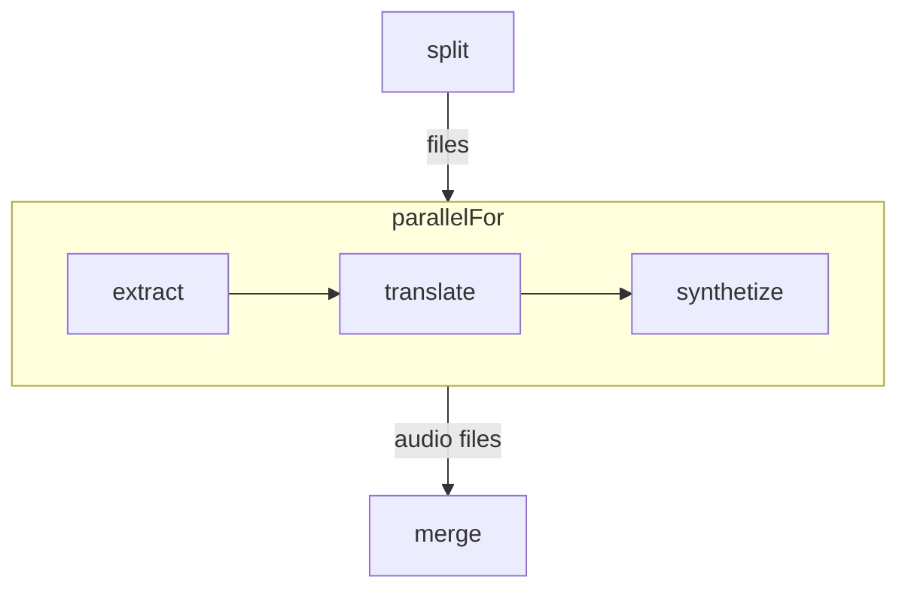
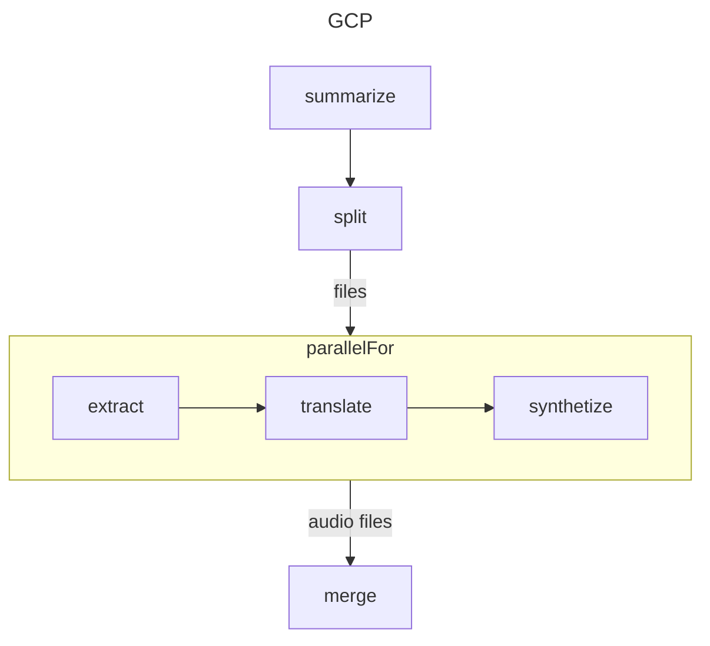
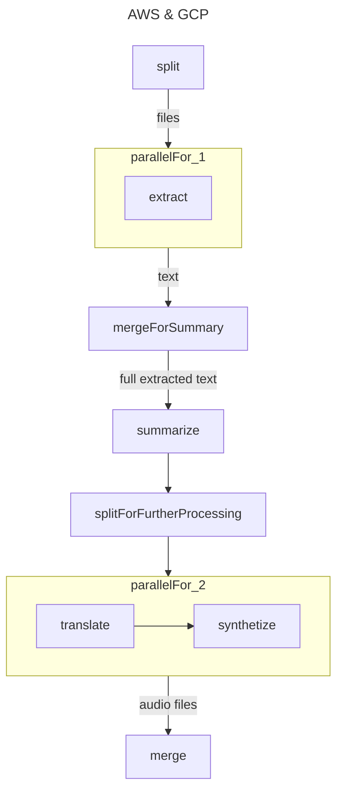
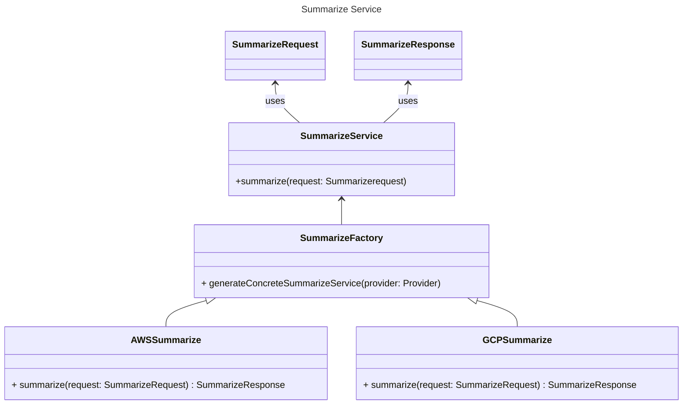

# CORE and pdf2Speech

## Usage

### Setup - ***setup.py***

The script copies *credential.json* into every function `src/main/resources/` folder. CORE's module *shared.Credentials* access this file through the method *loadDefaultCredentilas()* 
<details>
<summary>loadDefaultCredentials implementation</summary>

```java
// from https://github.com/FaaSTools/CORE/blob/main/shared/src/main/java/shared/Credentials.java
package shared;

public class Credentials{

    // ...

    public static Credentials loadDefaultCredentials() throws IOException {
        return loadFromResourceFolder("credentials.json");
    }

    public static Credentials loadFromResourceFolder(String path) throws IOException {
        InputStream in = Thread.currentThread().getContextClassLoader().getResourceAsStream(path);
        String credentialsString = new String(in.readAllBytes());
        return new Credentials(credentialsString);
    }

    // ...
}
```
</details>
<br>
The script then sets the required values for both the workflow and terraform.

### Workflow - AFCLx



- The split function divides a pdf file into smaller chunks.

- The inputs to the whole workflow (*ReadForMe/dataIns*) are accessed throughout the workflow body

- At each step within the parallel for they specified which parameter will be forwarded to the next function (i.e., *passing: true/false*).

The parallel for loops from *0* to *# files* with 

- Block(1) policy for files (i.e., distribute files)
- Replicate(*) (i.e., send the value to all) for
  - source language
  - target language
  - extract bucket
  - tranlsate bucket
  - synthetize bucket
  - output bucket
  - extract provider
  - translate provider
  - synthetize provider
  - extract region
  - translate region
  - synthetize region

## Functions implementation

Every function has three component
 - input (the structure is inferred from the data flow in the **AFCLx workflow**)
 - implementation, consisting of
   - handlers (one for each provider)
   - actual logic (*doWork*)
 - output, to pass to the next function (the structure is inferred from the data flow in the AFCLx workflow)

### split

With the credentials, using CORE shared.Credentials package, create a Storage object (CORE storage.Storage)

The SplitInput gave us the input bucket and the input file. We use this information to read the file from the specified bucket.

```java
Credentials credentials = Credentials.loadDefaultCredentials();
Storage storage = new StorageImpl(credentials);
byte[] inputPdf = storage.read(input.getInputBucket() input.getInputFile());
```

<details>
<summary>read from bucket - CORE</summary>
Parse file url using: storage.FileInfo, storage.BucketInfo

Parse a file given its url

It has two regex to identify if the file is stored in a AWS bucket or on GCP cloud storage

If the file matches one of the regex, then it is signed as Storage File (i.e., *isLocalFile* will return **false**)

It return a FileInfo object. Relevant infos:
- is it local
- BucketInfo
  - bucket url
  - bucket region
  - bucket provider
<br><br>
Once we have the FileInfo, read the file (either local input stream or using *StorageProvider.read*)

How do we read from a provider?

1. shared.Provider is an enum with all supported provider

2. storage.StorageProviderFactory will generate either a Google or an AWS StorageProvider (specific implementation)
</details>
<br><br>
Once we have the pdf, we split it in chunks

```java
PDDocument document = PDDocument.load(inputPdf);
Splitter splitting = new Splitter();
List<PDDocument> Page = splitting.split(document);
```

and we write all chunks in the appropriate output bucket (specified in the SplitInput)

Finally, we return a SplitOuput object with
- the names of the chunks (**files** of the split function output in AFCLx)
- the number of chunks (**count** of split function output in AFCLx)

<details>
<summary>write to storage - CORE</summary>

Similarly to read operation, parse the file url and generate a FileInfo object.

If it is hosted on a provider, create the StorageProvider using the factory and invoke StorageProvider.write
</details>

### extract

The SplitOutput is distributed in the paraller for accordingly to the AFCLx configuration.
On top of that, additional information is retrieved from the parallel for input data.

<details>
<summary>AFCLx and java implementation</summary>
For inststance, the name of the file each instance of the extract function has to read is the one passed by the distribution of the files handled by the parallel for

```yaml
- parallelFor:
    name: "parallelFor"
    dataIns:
      - name: "files"
        type: "collection"
        source: "split/files"
        constraints:
          - name: "distribution"
            value: "BLOCK(1)"
# [...]
loopBody:
      - function:
          name: "extract"
          type: "extractType"
          dataIns:
            - name: "inputFile"
              type: "string"
              source: "parallelFor/files"
# [...]
```
</details>
<br>
Once the file is retrieved, invoke the OCR service.
The service is dynamically selected. In the implementation we have the **abstraction of the CORE** exposed service.
The ORC service is selected based on the provider and the region of the ExtractInput.
<br><br>

<details>
<summary>OCR - CORE service abstraction</summary>

The *shared.Configuration* object gave us information about the default provider and the default regions (e.g., if the provider is not specified, by default use AWS)

The abstraction models a service with a method implementing the logic, a request builder and a response object.

The *OcrProviderFactory* will produce the concrete *OcrProvider* based on the provided shared.Provider and/or the service region.
The service region, when provided, can determine if the file will be passed by value.
If the service region is null either
- use the function's region, if it has the same provider as the service (AWS specific)
- use the default region (from the Configuration object)

Then each concrete provider will implement the *extract* method

Other services use a similar approach
</details>

## Our contribution



We need the whole file to create a reliable summary. Therefore, it makes sense to pass directly the summary to the split function.

AWS SageMaker uses a pre-trained model to perform the operation. The input needs to be a string, therefore we probably would have to adapt the workflow differently:



We will have to extend the CORE library with the *SummarizeService*



## References

\[1\] [CORE](https://github.com/FaaSTools/CORE)\
\[2\] [pdf2Speech](https://github.com/AFCLWorkflows/pdf2Speech)